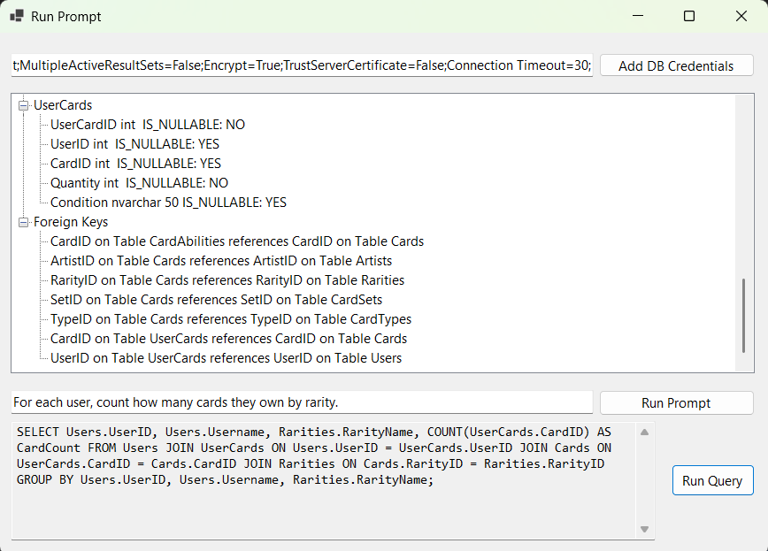
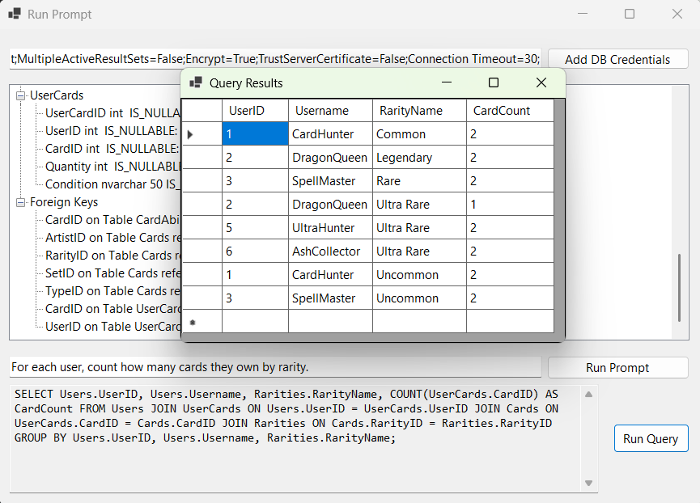
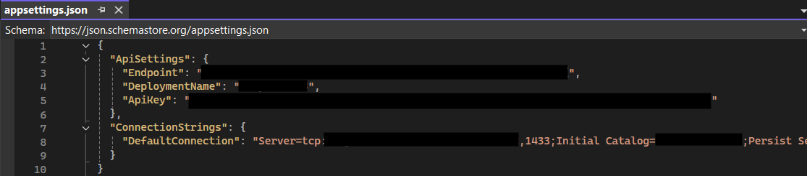

# AI SQL Generator #
----------

**How to Run**
Add appsettings.json to AI-SQL-Form project directory, include the endpoint, DeploymentName (AI Model) and ApiKey. You can include DefaultConnection DB Connection string to auto fill the DB Credentials field in the Form. Ensure in the appsettings.json File Properties, Copy to Output Directory is set to Copy Always. 

